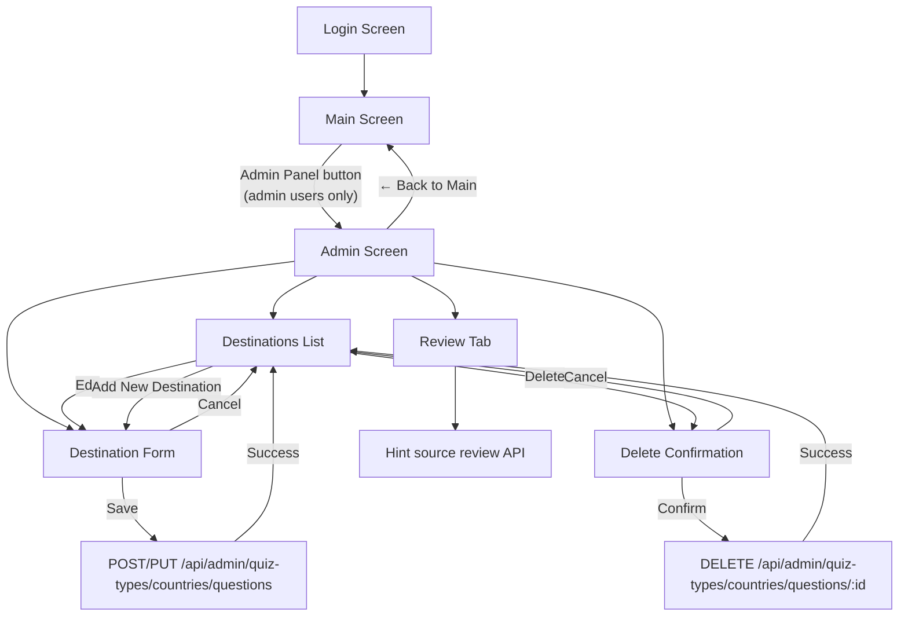
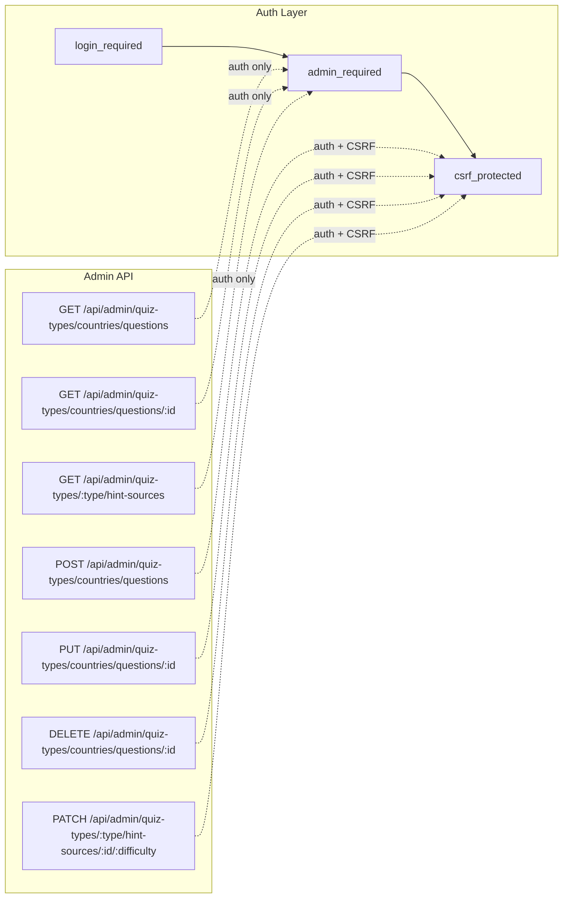

# Admin Page

The admin page allows users with the `is_admin` flag to manage quiz destinations through a browser-based interface.

## Navigation Flow



## API Endpoints



| Method | Endpoint | Auth | CSRF | Description |
|--------|----------|------|------|-------------|
| GET | `/api/admin/quiz-types/countries/questions` | admin | No | List all country questions (id + name) |
| GET | `/api/admin/quiz-types/countries/questions/:id` | admin | No | Get full country question data |
| POST | `/api/admin/quiz-types/countries/questions` | admin | Yes | Create a new country question |
| PUT | `/api/admin/quiz-types/countries/questions/:id` | admin | Yes | Replace all fields of a country question |
| DELETE | `/api/admin/quiz-types/countries/questions/:id` | admin | Yes | Delete country question + cascade results |
| GET | `/api/admin/quiz-types/:type/hint-sources` | admin | No | List hint sources by review status |
| PATCH | `/api/admin/quiz-types/:type/hint-sources/:id/:difficulty` | admin | Yes | Mark or unmark one hint source as reviewed |

The review list accepts `status=unreviewed` (the default), `status=reviewed`,
or `status=all`, plus `offset` and `limit` pagination parameters. Results are
ordered by question ID and hint difficulty. Empty hint sources are excluded.
Each result includes the question name, hint text, source, difficulty, and
reviewer/timestamp metadata when reviewed.

## Screen Layout

```
┌─────────────────────────────────────────────────────┐
│  🔧 Admin: Quiz Management          [← Back to Main]│
├─────────────────────────────────────────────────────┤
│  Total destinations: 3                               │
│  [Destinations] [Review]                             │
│  [Add New Destination]                               │
│                                                      │
│  ┌─────────────────────────────────────────────────┐ │
│  │ #1  Paris                        [Edit] [Delete]│ │
│  ├─────────────────────────────────────────────────┤ │
│  │ #2  Tokyo                        [Edit] [Delete]│ │
│  ├─────────────────────────────────────────────────┤ │
│  │ #3  New York                     [Edit] [Delete]│ │
│  └─────────────────────────────────────────────────┘ │
└─────────────────────────────────────────────────────┘
```

The Review tab defaults to **Needs review** and shows populated hint sources
that have not been verified by an administrator. The **Reviewed** filter lets
an administrator inspect completed items and undo a review. Editing a source
returns that hint source to the review queue.

## Destination Form

```
┌─────────────────────────────────────────────────────┐
│  Add New Destination / Edit Destination              │
├─────────────────────────────────────────────────────┤
│  Name:      [________________________]               │
│                                                      │
│  Hint 1:    [________________________]               │
│  Hint 2:    [________________________]               │
│  Hint 3:    [________________________]               │
│  Hint 4:    [________________________]               │
│  Hint 5:    [________________________]               │
│                                                      │
│  Image files (2–10):                                 │
│    [Choose file                         ] [✕]        │
│    [Choose file                         ] [✕]        │
│    [+ Add Image File]                                │
│                                                      │
│  Correct Answers (1–20):                             │
│    [paris                               ] [✕]        │
│    [paris, france                       ] [✕]        │
│    [+ Add Answer]                                    │
│                                                      │
│  [Save]  [Cancel]                                    │
└─────────────────────────────────────────────────────┘
```

## Validation Rules

| Field | Constraints |
|-------|-------------|
| Name | 1–128 characters, not blank |
| Hints | Exactly 5, each 1–256 characters, not blank |
| Images | 2–10 image files selected from the local device |
| Correct Answers | 1–20 items, each 1–128 characters |

Answers are normalized (lowercased + trimmed) before storage.

## Error Responses

| Status | Condition |
|--------|-----------|
| 401 | Not authenticated |
| 403 | Not admin, or missing/invalid CSRF token |
| 400 | Validation failure (details in response) |
| 404 | Destination not found |
| 409 | Duplicate destination name |
