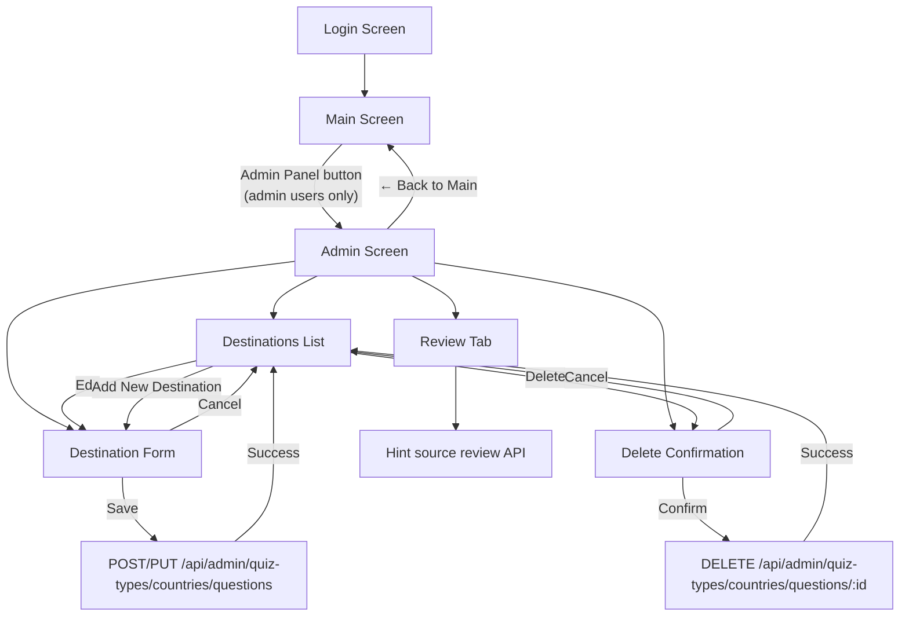
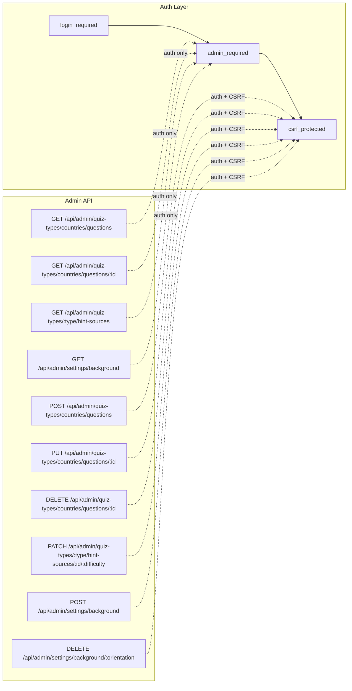

# Admin Page

The admin page allows users with the `is_admin` flag to manage quiz destinations through a browser-based interface.

## Navigation Flow



## API Endpoints



| Method | Endpoint | Auth | CSRF | Description |
|--------|----------|------|------|-------------|
| GET | `/api/admin/quiz-types/countries/questions` | admin | No | List all country questions (id + name) |
| GET | `/api/admin/quiz-types/countries/questions/:id` | admin | No | Get full country question data |
| POST | `/api/admin/quiz-types/countries/questions` | admin | Yes | Create a new country question |
| PUT | `/api/admin/quiz-types/countries/questions/:id` | admin | Yes | Replace all fields of a country question |
| DELETE | `/api/admin/quiz-types/countries/questions/:id` | admin | Yes | Delete country question + cascade results |
| GET | `/api/admin/quiz-types/:type/hint-sources` | admin | No | List hint sources by review status |
| PATCH | `/api/admin/quiz-types/:type/hint-sources/:id/:difficulty` | admin | Yes | Mark or unmark one hint source as reviewed |
| GET | `/api/settings/background` | public | No | Get current background image paths for portrait and landscape |
| GET | `/api/admin/settings/background` | admin | No | Get current background image settings |
| POST | `/api/admin/settings/background` | admin | Yes | Upload portrait and/or landscape background images |
| DELETE | `/api/admin/settings/background/:orientation` | admin | Yes | Remove portrait, landscape, or all background images |

The review list accepts `status=unreviewed` (the default), `status=reviewed`,
or `status=all`, plus `offset` and `limit` pagination parameters. Results are
ordered by question ID and hint difficulty. Empty hint sources are excluded.
Each result includes the question name, hint text, source, difficulty, and
reviewer/timestamp metadata when reviewed.

The Background tab allows administrators to configure custom background images for the entire app:
- **Portrait orientation**: applied when the device/browser is in portrait orientation (`@media (orientation: portrait)`).
- **Landscape orientation**: applied when the device/browser is in landscape orientation (`@media (orientation: landscape)`).

## Screen Layout

```
┌─────────────────────────────────────────────────────┐
│  🔧 Admin: Quiz Management          [← Back to Main]│
├─────────────────────────────────────────────────────┤
│  Total destinations: 3                               │
│  [Destinations] [Review] [Background]                │
│  [Add New Destination]                               │
│                                                      │
│  ┌─────────────────────────────────────────────────┐ │
│  │ #1  Paris                        [Edit] [Delete]│ │
│  ├─────────────────────────────────────────────────┤ │
│  │ #2  Tokyo                        [Edit] [Delete]│ │
│  ├─────────────────────────────────────────────────┤ │
│  │ #3  New York                     [Edit] [Delete]│ │
│  └─────────────────────────────────────────────────┘ │
└─────────────────────────────────────────────────────┘
```

The Review tab defaults to **Needs review** and shows populated hint sources
that have not been verified by an administrator. The **Reviewed** filter lets
an administrator inspect completed items and undo a review. Editing a source
returns that hint source to the review queue.

## Destination Form

```
┌─────────────────────────────────────────────────────┐
│  Add New Destination / Edit Destination              │
├─────────────────────────────────────────────────────┤
│  Name:      [________________________]               │
│                                                      │
│  Hint 1:    [________________________]               │
│  Hint 2:    [________________________]               │
│  Hint 3:    [________________________]               │
│  Hint 4:    [________________________]               │
│  Hint 5:    [________________________]               │
│                                                      │
│  Image files (2–10):                                 │
│    [Choose file                         ] [✕]        │
│    [Choose file                         ] [✕]        │
│    [+ Add Image File]                                │
│                                                      │
│  Correct Answers (1–20):                             │
│    [paris                               ] [✕]        │
│    [paris, france                       ] [✕]        │
│    [+ Add Answer]                                    │
│                                                      │
│  [Save]  [Cancel]                                    │
└─────────────────────────────────────────────────────┘
```

## Validation Rules

| Field | Constraints |
|-------|-------------|
| Name | 1–128 characters, not blank |
| Hints | Exactly 5, each 1–256 characters, not blank |
| Images | 2–10 image files selected from the local device |
| Correct Answers | 1–20 items, each 1–128 characters |

Answers are normalized (lowercased + trimmed) before storage.

## Error Responses

| Status | Condition |
|--------|-----------|
| 401 | Not authenticated |
| 403 | Not admin, or missing/invalid CSRF token |
| 400 | Validation failure (details in response) |
| 404 | Destination not found |
| 409 | Duplicate destination name |

## Admin Account Management

Admin privileges are granted by setting `is_admin=True` on the `user` table. Admin accounts can be created or managed through the following workflows:

### 1. Environment Bootstrap / Seeding

On startup (or when running `scripts.seed_db`), the application can automatically create or update a bootstrap admin account:

- **Environment variables:**
  - `ADMIN_BOOTSTRAP_EMAIL`: Bootstrap admin email (defaults to `admin@example.com`).
  - `ADMIN_BOOTSTRAP_PASSWORD`: Bootstrap admin password (must be at least 12 characters).
  - `REQUIRE_CUSTOM_ADMIN_BOOTSTRAP=true`: Enforces that a custom password is provided if no admin user already exists.
- **Behavior:**
  - If a user with `ADMIN_BOOTSTRAP_EMAIL` already exists, its password is updated and `is_admin` is set to `True`.
  - If no matching user exists, a new admin account is created.
  - If `ADMIN_BOOTSTRAP_PASSWORD` is omitted and `REQUIRE_CUSTOM_ADMIN_BOOTSTRAP` is not set, a default development account (`admin@example.com` / `adminpass123`) is seeded.

### 2. Promoting or Creating Admins via Python Shell

To add additional admins or promote existing registered users to administrators, run a Python snippet within the app context:

```bash
uv run python -c "
from backend import app
from backend.models import db, User
from werkzeug.security import generate_password_hash

with app.app_context():
    email = 'admin2@example.com'
    user = User.query.filter_by(email=email).first()
    if user:
        user.is_admin = True
        print(f'Promoted {email} to admin')
    else:
        user = User(
            email=email,
            password_hash=generate_password_hash('strong_password_here'),
            is_admin=True
        )
        db.session.add(user)
        print(f'Created new admin: {email}')
    db.session.commit()
"
```

### 3. Password Reset for Existing Admins

When SMTP is configured (`SMTP_HOST`, `SMTP_PORT`, etc.), administrators can reset their password via the **Forgot Password?** modal on the login screen.
