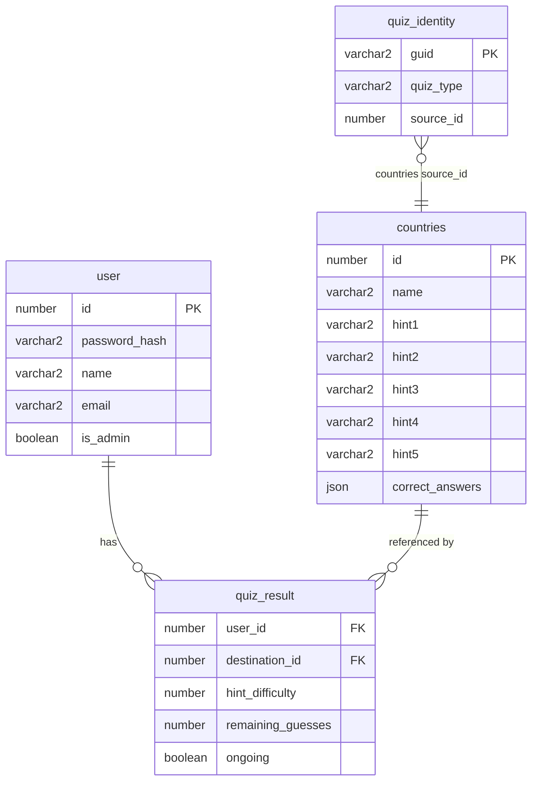

`quiz_identity` is a polymorphic public-identity catalog. Its
`(quiz_type, source_id)` pair is unique, while `guid` is a canonical UUID v4
used by public quiz lookup and links such as `/?quiz=<guid>`. The catalog does
not use a database foreign key because registered quiz types may use different
source tables.

GUIDs are generated per deployment. Restoring the database preserves them;
rebuilding a database from source data may produce different GUIDs. Integer
source IDs remain internal keys for result relationships, scoring, complaints,
and media directories.
