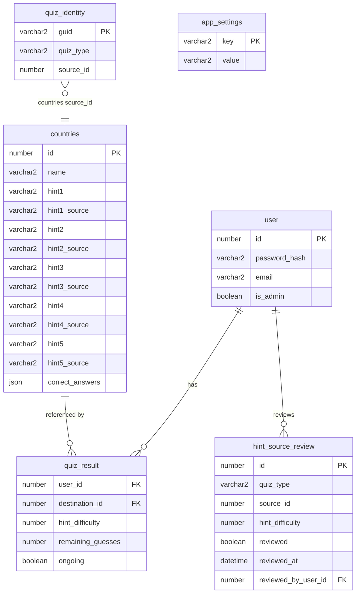

`quiz_identity` is a polymorphic public-identity catalog. Its
`(quiz_type, source_id)` pair is unique. The `guid` column is an internal
canonical UUID v4 key; public lookup and links use a compact type-scoped ID such
as `c42` in `/quiz/c42`. The catalog does not use a database foreign key because
registered quiz types may use different source tables.

Restoring the database preserves the internal identity rows and their existing
links. Rebuilding a database from source data preserves the compact IDs as long
as the source IDs and registered type codes remain unchanged. Integer source IDs
remain the keys for result relationships, scoring, complaints, and media
directories.

`app_settings` stores key-value configuration for application-level settings,
such as `background_portrait` and `background_landscape` media paths.

`hint_source_review` stores review workflow state independently from quiz
content. Its `(quiz_type, source_id, hint_difficulty)` tuple is unique so each
populated hint source can be reviewed independently across registered quiz
types. A missing or false review row means the source is unreviewed. Reviewed
rows retain the administrator and UTC timestamp. Updating a source through the
admin API removes its prior review state so changed content returns to the
queue; deleting a question removes its review rows.
