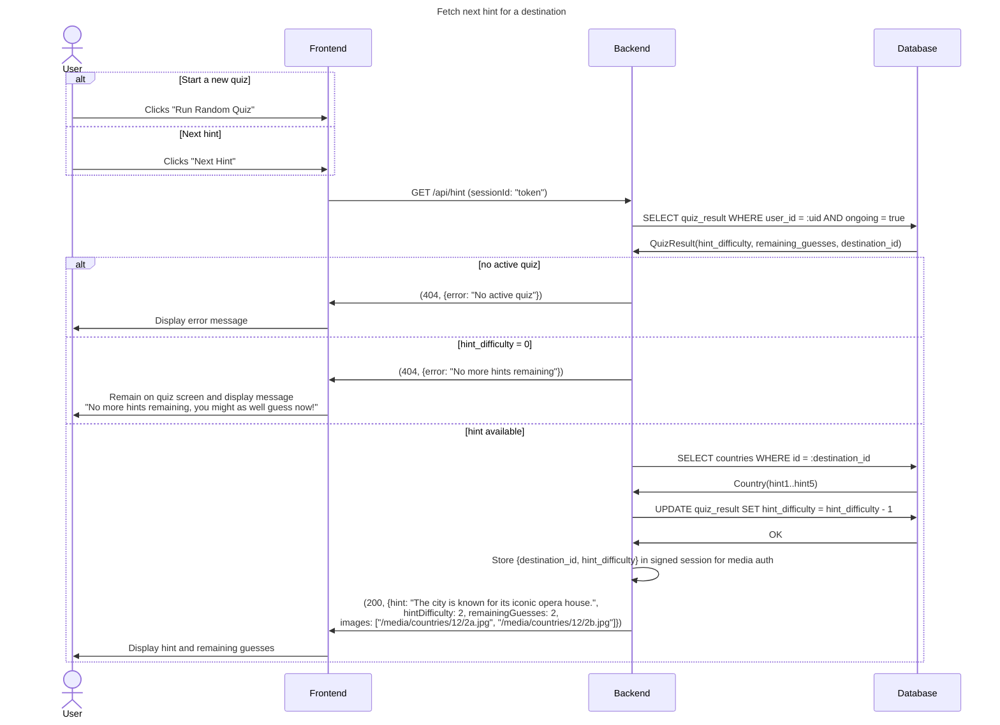

## Performance Note

- Hint image authorization now uses a session-cached media access state (`destination_id`, `hint_difficulty`) that is updated on quiz start, hint changes, and active-quiz restore.
- This avoids repeated active-quiz database lookups for each `/media/...` hint image request during normal hint navigation.
- If the session cache is absent, the server falls back to the database-backed authorization check.

## Hint Review Behavior

- The frontend stores unlocked hints per difficulty and renders review buttons in descending difficulty order.
- The active review selection is tracked separately from live server progression, so users can inspect earlier hints without changing backend state.
- Each unlocked hint difficulty keeps its own image pair.
- When a user clicks an older hint in review, both hint text and quiz images switch to that hint's snapshot.
- If a saved image pair is unavailable, the frontend falls back to deterministic URLs using destination id and difficulty (`/media/countries/<id>/<difficulty>a.jpg`, `/media/countries/<id>/<difficulty>b.jpg`).
