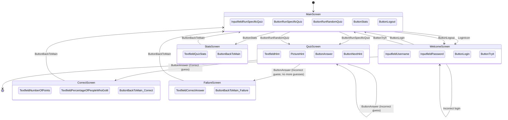

## Related Docs

- Hint flow details, including hint review image switching behavior: [hint.md](hint.md)
- Media image naming and authorization behavior (including session-cache fast path): [media_images.md](media_images.md)

## Frontend Composition Notes

- The production home page (`/`) is rendered from `backend/templates/index.html` and composed from partials under `backend/templates/partials/`.
- Frontend Jasmine specs still use the static fixture in `frontend/index.html`.
- During this migration phase, treat backend-rendered home markup and static fixture markup as paired sources and keep them aligned.
- Parity checks in `test_backend/test_main.py` enforce key IDs, script load order, and screen/modal ordering.
