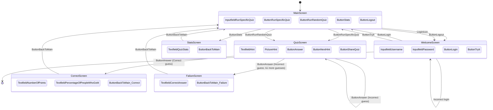

## Related Docs

- Hint flow details, including hint review image switching behavior: [hint.md](hint.md)
- Media image naming and authorization behavior (including session-cache fast path): [media_images.md](media_images.md)
- Quiz-type adapter and registration contract: [quiz_types.md](quiz_types.md)

## Frontend Composition Notes

- The production home page (`/`) is rendered from `backend/templates/index.html` and composed from partials under `backend/templates/partials/`.
- Backend-rendered home markup is the source of truth for page structure.
- Guardrail checks in `test_backend/test_main.py` enforce key IDs, script load order, and screen/modal ordering on the rendered page.

## Sharing Quizzes

- Public quiz identities use a compact type-scoped ID, such as `c42` for
    countries quiz row 42. Internal UUID v4 keys remain in the central
    `quiz_identity` catalog. Bare numeric destination IDs are not accepted by
    the public specific-quiz endpoint.
- A shared URL uses `/quiz/<public-id>`. After the application restores or creates
    a player session, the linked quiz starts automatically and takes precedence
    over restoring a different active quiz.
- The quiz screen copies the deep link to the clipboard.

## Migration Milestone

Date: 2026-07-16

- Home-page backend template composition now uses screen and modal partials under `backend/templates/partials/`.
- Backend tests include rendered-page guardrails for critical IDs, script order, and screen/modal order.
- E2E quiz flow assertions were updated to current `resultsScreen` behavior after the screen-controller refactor.
